# MVP: pipeline de dados sobre vôlei de praia no Databricks

Pipeline em arquitetura Medallion (bronze, silver e gold) sobre 76.756 partidas dos circuitos FIVB e
AVP entre 2000 e 2019. Trabalho desenvolvido para a disciplina de Engenharia de Dados da
pós-graduação da PUC-Rio.

## Contexto de Negócios e Perguntas

### Objetivo

Este trabalho parte de um histórico de 76.756 partidas de vôlei de praia profissional, dos circuitos
FIVB e AVP entre 2000 e 2019, para investigar se fatores como o ranking de entrada, altura, idade
dos atletas, jogar no próprio país e fundamentos de jogo estão associados à vitória. Como o período
cobre duas décadas, também verificamos se o jogo mudou nesse intervalo.

Isso se resume em uma pergunta central, **o que separa quem vence no vôlei de praia profissional, e
isso mudou ao longo de duas décadas?** Essa pergunta foi desdobrada em seis perguntas de negócio, agrupadas em
três blocos.

**Torneio**

1. O ranking de entrada prediz o resultado da partida? Com que frequência a dupla pior ranqueada vence, e isso muda entre grupos, qualificatória e eliminatória?
2. O jogo mudou ao longo das duas décadas? Duração das partidas e proporção de 2×1 por circuito e por período.

**Atleta**

3. Quem é mais alto vence mais? A relação é a mesma no masculino e no feminino?
4. A idade pesa no resultado? Em que faixa etária a taxa de vitória é maior?
5. Jogar em casa ajuda? Taxa de vitória quando o torneio é no país do atleta, comparada a fora.

**Fundamentos**

6. Nas partidas com estatística detalhada, qual fundamento mais separa vencedores de perdedores: ataque, saque, bloqueio ou defesa?

### Os dados

O arquivo [`vb_matches.csv`](https://www.kaggle.com/datasets/jessemostipak/beach-volleyball) vem do
Kaggle, espelho do dataset publicado pelo projeto TidyTuesday e compilado a partir
dos resultados públicos dos sites da FIVB e da AVP. O arquivo tem 76.756 linhas e 65 colunas, uma linha por
partida, cobrindo o World Tour da FIVB e o circuito AVP (Estados Unidos) de setembro de 2000 a 2019,
masculino e feminino. 

Cada linha descreve uma partida completa: os dados do torneio, o placar, e os quatro atletas (dois
vencedores e dois perdedores), cada um com o próprio conjunto de colunas de identificação e de
estatísticas.

O dicionário completo está no [readme da fonte](https://github.com/rfordatascience/tidytuesday/blob/main/data/2020/2020-05-19/readme.md).


### Licença

A página do Kaggle marca a licença como "Unknown", mas o arquivo é um espelho do dataset do
[TidyTuesday](https://github.com/rfordatascience/tidytuesday/tree/main/data/2020/2020-05-19), cujo
repositório é distribuído sob [CC0 1.0 Universal](https://github.com/rfordatascience/tidytuesday/blob/main/LICENSE), que libera o seu uso.


## Carga dos Dados

A carga tem duas partes: o arquivo entra na nuvem por upload manual e um notebook o transforma em
tabela Delta.

**Upload.** O `vb_matches.csv` (30 MB) foi baixado do Kaggle e enviado pelo Catalog Explorer para o
Volume `workspace.bronze.raw_files`, um diretório de arquivos gerenciado pelo Unity Catalog. Uma
cópia do arquivo está em [`data/vb_matches.csv`](data/vb_matches.csv).

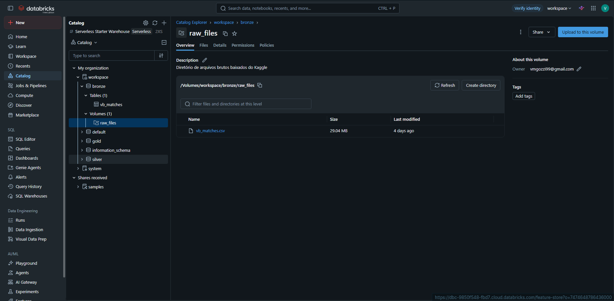

**Ingestão.** O notebook [`extract_bronze`](notebooks/extract_bronze.ipynb) lê o CSV do Volume e
grava a tabela `bronze.vb_matches` em Delta, sem nenhuma transformação: as 65 colunas entram como
texto, exatamente como estão no arquivo. A única opção de leitura fora do padrão é `escape = '"'`,
necessária porque alguns nomes de atleta trazem apelido entre aspas. Três colunas de metadados são
acrescentadas (`_ingestao_ts`, `_arquivo_origem`, `_camada`), e a validação no fim do notebook
confere que a tabela tem as mesmas 76.756 linhas do arquivo.

> A carga é feita com `overwrite`, aqui e nas camadas seguintes, porque a fonte é um arquivo estático,publicado > publicado uma vez e sem atualização.

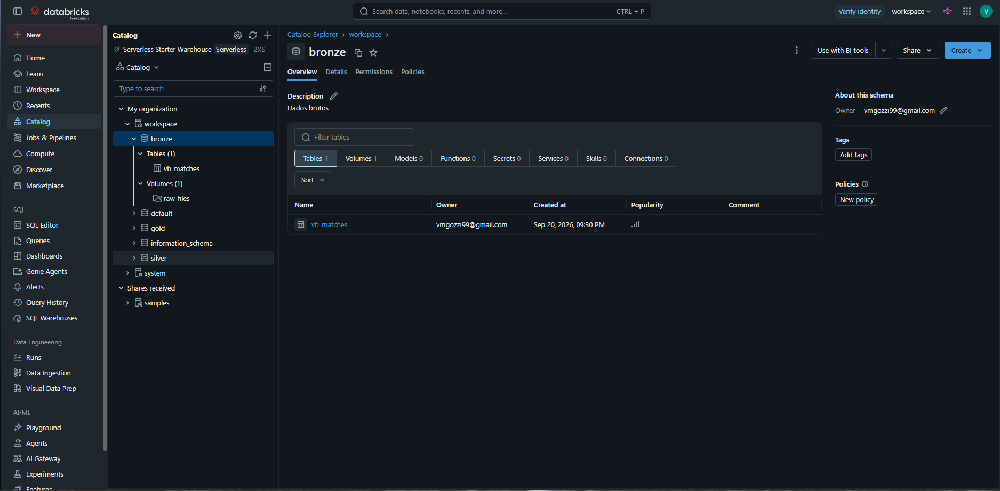

## Modelagem e Catálogo de Dados

### Camadas

| Camada | Tabelas | O que é |
|---|---|---|
| `bronze` | `vb_matches` | cópia fiel do CSV, tudo como texto |
| `silver` | `partida`, `atleta_partida` | dados limpos e tipados, sem exclusão de linhas; exceções viram flags |
| `gold` | `dim_data`, `dim_torneio`, `dim_atleta`, `dim_fase`, `fato_partida`, `fato_atleta_partida` | esquema estrela, pronto para as perguntas |

### Silver: duas tabelas

Na fonte, cada linha é uma partida e os quatro atletas ficam em colunas. Isso serve para ler o
resultado, mas não para perguntar sobre atletas: qualquer conta por altura, idade ou fundamento
teria de ser repetida para as quatro posições e somada depois. Por isso a silver reorganiza a fonte
em duas tabelas: `partida`, com uma linha por partida e os atributos da partida (placar, duração,
seeds, fase), e `atleta_partida`, com uma linha para cada atleta, ou seja, quatro por
partida (307.024 no total), com os atributos do atleta naquela participação (idade, altura,
estatísticas). Atributos fixos do atleta, como nome, nascimento e país, ainda se repetem a cada
participação nessa camada.

O tratamento da silver segue o que o notebook
[`diagnostico_qualidade`](notebooks/diagnostico_qualidade.ipynb) mediu na bronze, e cada seção do
[`transform_silver`](notebooks/transform_silver.ipynb) aponta a seção do diagnóstico que a justifica. Em resumo:

- o texto `"NA"`, que a fonte usa para ausência, vira NULL;
- data, ano, número da partida, duração e altura ganham seus tipos, com a altura convertida de
polegadas para centímetros;
- o ranking, que a fonte traz em três formatos no mesmo campo, é separado em seed principal e seed de
qualificatória;
- o placar é decomposto em sets de cada dupla, e a idade é recalculada a partir do nascimento e da
data da partida, porque a idade informada estava errada em 460 linhas;
- as exceções (partida incompleta, duração implausível, placar que contradiz o vencedor, estatística
inválida, idade atípica) viram flags, sem excluir nenhuma linha.
    
Uma dessas exceções definiu a chave de `atleta_partida`: em 7 partidas a fonte registra a mesma dupla como vencedora e perdedora (bye ou W.O.), então a chave é `(id_partida, id_atleta, vencedor)`, e não só partida e atleta.

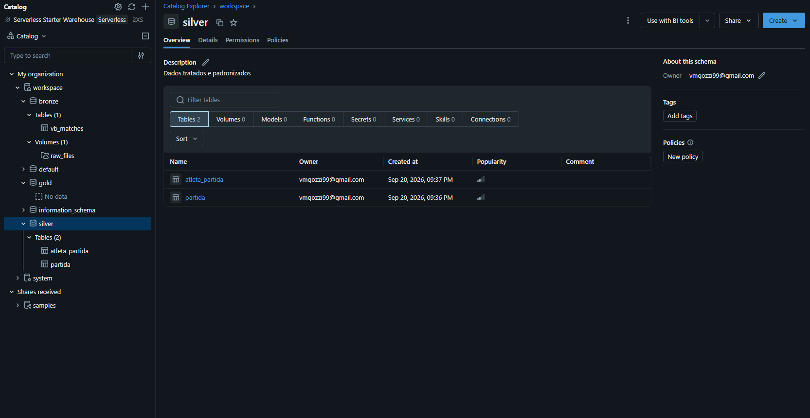

### Gold: esquema estrela

A gold, construída pelo notebook [`load_gold`](notebooks/load_gold.ipynb), é um esquema estrela
com dois fatos e quatro dimensões, desenhado a partir do grão e das perguntas. Os dois grãos da silver viraram dois fatos. As dimensões são o que as perguntas usam para agrupar ou filtrar: período,
torneio, fase e atleta, cada uma com grão próprio e mais de um atributo. Circuito, gênero e país não
viraram dimensões porque teriam uma coluna só, e ficam como atributos de `dim_torneio` e
`dim_atleta`; pela mesma razão o modelo é estrela e não floco de neve, já que normalizar essas
dimensões acrescentaria joins sem acrescentar informação. Tabelas de agregados também não foram
criadas, porque as seis consultas rodam direto nos fatos.


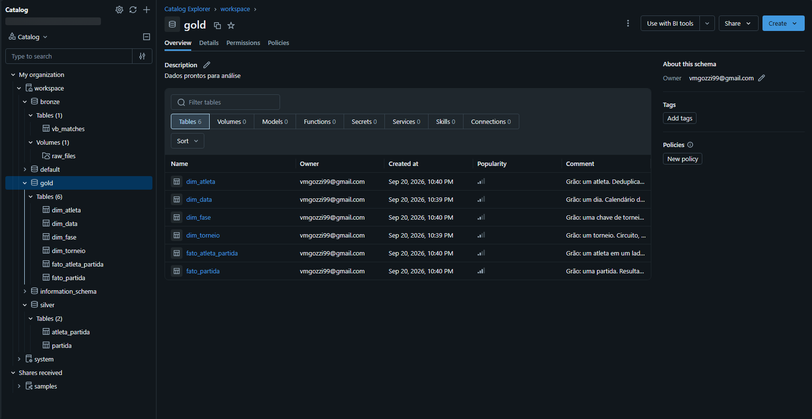

| Tabela | Grão | Perguntas |
|---|---|---|
| `fato_partida` | uma partida | 1, 2 |
| `fato_atleta_partida` | um atleta em um lado de uma partida | 3, 4, 5, 6 |
| `dim_data` | um dia | 2 |
| `dim_torneio` | um torneio: circuito, cidade, país, ano e gênero | 2, 5 |
| `dim_atleta` | um atleta | 3, 6 |
| `dim_fase` | uma chave de torneio (`bracket`) e a fase que ela representa | 1 |

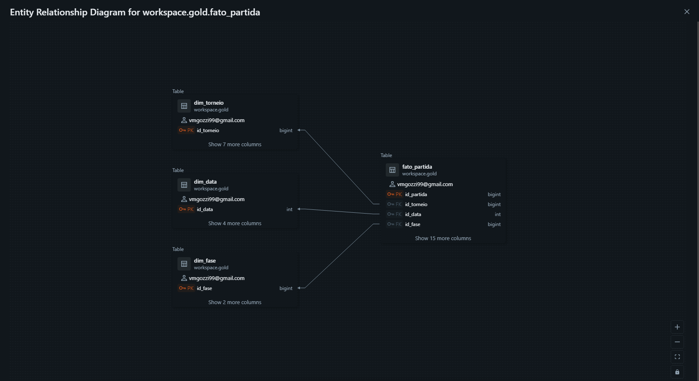
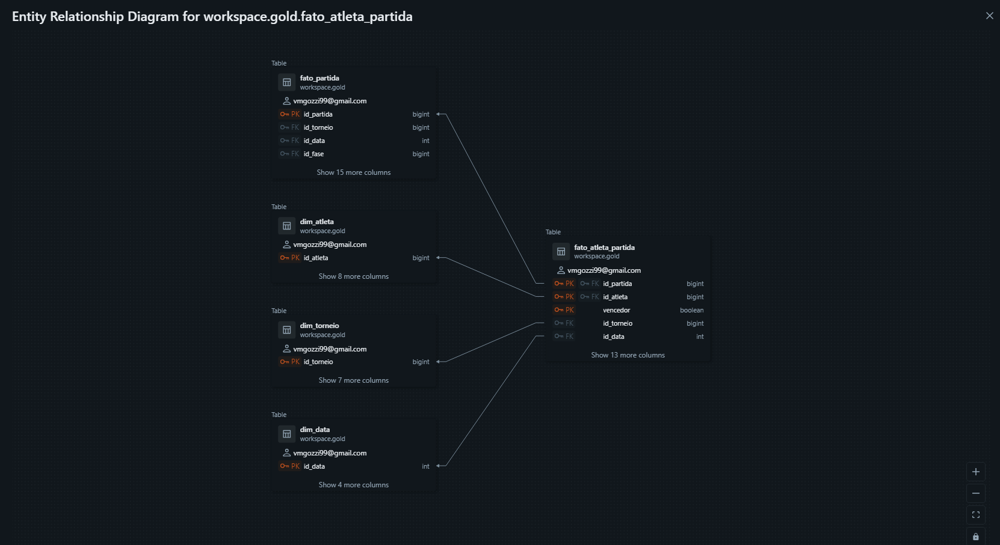

### Catálogo de dados

O catálogo é aplicado no Unity Catalog pelo notebook [`catalogo`](notebooks/catalogo.ipynb): um
dicionário Python com grão, descrição e uma frase por coluna, e uma função que grava `COMMENT` em
cada tabela e coluna, `NOT NULL` nas chaves e as constraints de chave primária e estrangeira. A
conferência no fim do notebook lê `information_schema.columns` e confirma que as 9 tabelas têm todas
as colunas comentadas.

As chaves primárias e estrangeiras declaradas pelo catálogo são as que o diagrama de
relacionamentos da seção anterior desenha.

A transcrição abaixo traz, por tabela, o grão e a origem, e por coluna o tipo, a descrição com o
domínio e, onde a coluna não vem direto da fonte, a regra que a produz.

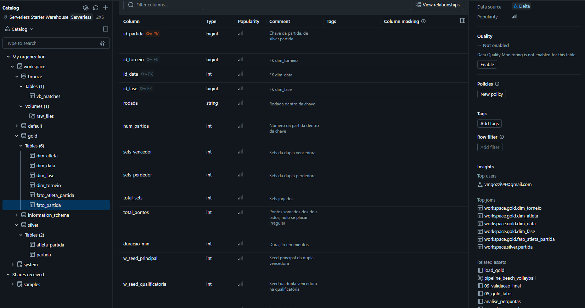
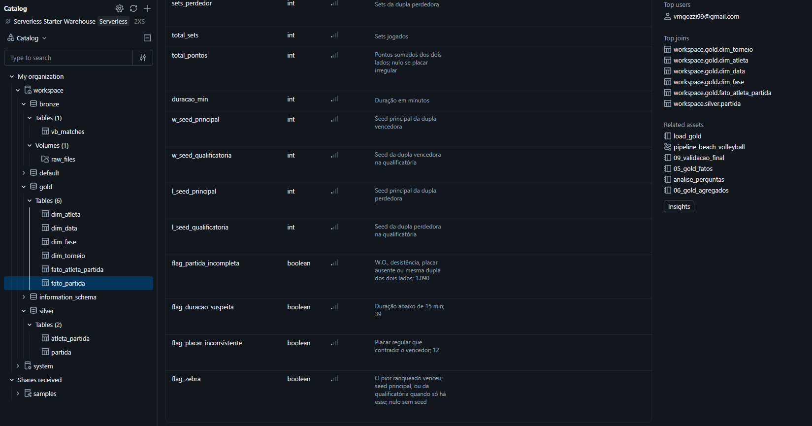

#### `bronze.vb_matches`

Grão: uma partida, cópia fiel do CSV. 76.756 linhas; 65 colunas da fonte como `string` mais 3
metadados. Origem: `vb_matches.csv`, sem transformação. Ausência é o texto `"NA"`. Os quatro blocos
de atleta (`w_p1`, `w_p2`, `l_p1`, `l_p2`) têm as mesmas 13 colunas; a tabela lista o bloco uma vez.

| Coluna | Tipo | Descrição e domínio |
|---|---|---|
| `circuit` | string | `AVP` ou `FIVB` |
| `tournament` | string | cidade-sede |
| `country` | string | país-sede |
| `year` | string | ano, 2000 a 2019 |
| `date` | string | data do torneio, ISO |
| `gender` | string | `M` ou `W` |
| `match_num` | string | número da partida dentro da chave |
| `bracket` | string | chave ou grupo do torneio, 36 valores |
| `round` | string | rodada; `"NA"` em 6,4% |
| `score` | string | placar por set (`21-19, 18-21, 15-13`); `Forfeit or other`, `... retired` ou `"NA"` em 1.089 |
| `duration` | string | duração `hh:mm:ss`; `"NA"` em 2,9% |
| `w_rank`, `l_rank` | string | seed da dupla: `7`, `Q9` ou `24, Q30` |
| `*_player1`, `*_player2` | string | nome do atleta |
| `*_p1_birthdate`, `*_p2_birthdate` | string | nascimento, ISO, 1953 a 2004 |
| `*_p1_age`, `*_p2_age` | string | idade informada; errada em 460 linhas |
| `*_p1_hgt`, `*_p2_hgt` | string | altura em polegadas, 63 a 85 |
| `*_p1_country`, `*_p2_country` | string | país do atleta |
| `*_tot_attacks`, `*_tot_kills`, `*_tot_errors` | string | ataques, pontos de ataque, erros de ataque; `"NA"` em ~81% |
| `*_tot_hitpct` | string | aproveitamento, (kills − erros) / ataques |
| `*_tot_aces`, `*_tot_serve_errors` | string | aces e erros de saque |
| `*_tot_blocks`, `*_tot_digs` | string | bloqueios e defesas |
| `_ingestao_ts` | timestamp | data e hora da carga |
| `_arquivo_origem` | string | caminho do arquivo no Volume |
| `_camada` | string | `bronze` |

#### `silver.partida`

Grão: uma partida. 76.756 linhas, nenhuma excluída. PK `id_partida`. Origem: `bronze.vb_matches`.

| Coluna | Tipo | Descrição e domínio | Origem |
|---|---|---|---|
| `id_partida` | bigint | chave substituta | `xxhash64(tournament, date, gender, bracket, match_num)` |
| `circuito` | string | `AVP` ou `FIVB` | `circuit` |
| `torneio` | string | cidade-sede | `tournament` |
| `pais_torneio` | string | país-sede | `country` |
| `ano` | int | 2000 a 2019 | `cast(year as int)` |
| `data` | date | data do torneio, a partir de 2000-09-16 | `to_date(date)` |
| `genero` | string | `M` ou `W` | `gender` |
| `num_partida` | int | número da partida dentro da chave | `cast(match_num as int)` |
| `chave` | string | chave ou grupo do torneio, 36 valores | `bracket` |
| `rodada` | string | rodada dentro da chave; nula em 6,4% | `round` |
| `fase` | string | `grupos`, `qualificatoria` ou `eliminatoria` | `Pool*` → grupos; `Qualifier*` e `Country Quota` → qualificatória; demais → eliminatória |
| `placar` | string | placar por set como na fonte | `score` |
| `placar_regular` | boolean | placar no formato `a-b` por set; falso em 1.089 | regex sobre `score` |
| `sets_vencedor` | int | 0 a 3; nulo se placar irregular | sets com `a > b` em `score` |
| `sets_perdedor` | int | 0 a 2; nulo se placar irregular | sets com `a < b` em `score` |
| `duracao_min` | int | 2 a 134; nula em 2,9% | `duration` para minutos |
| `w_seed_principal`, `l_seed_principal` | int | seed na chave principal | parte sem `Q` de `w_rank` / `l_rank` |
| `w_seed_qualificatoria`, `l_seed_qualificatoria` | int | seed na qualificatória | parte com `Q` de `w_rank` / `l_rank` |
| `flag_partida_incompleta` | boolean | W.O., desistência, placar ausente ou mesma dupla dos dois lados; 1.090 | `NOT placar_regular` ou mesma dupla |
| `flag_duracao_suspeita` | boolean | duração abaixo de 15 min; 39 | `duracao_min < 15` |
| `flag_placar_inconsistente` | boolean | placar regular que contradiz o vencedor; 12 | `sets_vencedor <= sets_perdedor` ou `sets_vencedor = 3` |
| `_processado_em` | timestamp | data e hora do processamento | `current_timestamp()` |

#### `silver.atleta_partida`

Grão: um atleta em um lado de uma partida. 307.024 linhas, quatro por partida. PK
`(id_partida, id_atleta, vencedor)`. Origem: as quatro posições de `bronze.vb_matches` empilhadas.

| Coluna | Tipo | Descrição e domínio | Origem |
|---|---|---|---|
| `id_partida` | bigint | FK `silver.partida` | mesmo hash |
| `data` | date | data do torneio | `date` |
| `genero` | string | `M` ou `W` | `gender` |
| `vencedor` | boolean | estava na dupla vencedora | lado da fonte (`w_*` ou `l_*`) |
| `nome` | string | nome do atleta, espaços normalizados | `*_player`, com `trim` e colapso de espaço duplo |
| `nascimento` | date | 1953 a 2004; nula em 791 atletas | `to_date(*_birthdate)` |
| `pais` | string | país do atleta naquela partida | `*_country` |
| `tot_attacks`, `tot_kills`, `tot_errors` | double | ataques, pontos de ataque, erros de ataque | `try_cast(*_tot_*)` |
| `tot_hitpct` | double | aproveitamento, −1 a 1 quando válido | idem |
| `tot_aces`, `tot_serve_errors`, `tot_blocks`, `tot_digs` | double | aces, erros de saque, bloqueios, defesas | idem |
| `id_atleta` | bigint | chave substituta do atleta | `xxhash64(lower(nome), nascimento)` |
| `altura_cm` | int | 160 a 216 | `round(*_hgt × 2,54)` |
| `idade_na_partida` | int | 13 a 67 | meses entre `nascimento` e `data` / 12; a `*_age` da fonte foi descartada |
| `tem_estatistica` | boolean | estatísticas registradas; 19% | `tot_attacks IS NOT NULL` |
| `flag_estatistica_invalida` | boolean | ataques negativos ou aproveitamento fora de [−1, 1]; 32 | regra sobre `tot_attacks` e `tot_hitpct` |
| `flag_idade_atipica` | boolean | idade abaixo de 15 ou acima de 50 | regra sobre `idade_na_partida` |
| `_processado_em` | timestamp | data e hora do processamento | `current_timestamp()` |

#### `gold.dim_data`

Grão: um dia. 6.922 linhas. PK `id_data`. Origem: sequência de datas entre a primeira e a última
partida de `silver.partida`.

| Coluna | Tipo | Descrição e domínio |
|---|---|---|
| `id_data` | int | data como inteiro AAAAMMDD |
| `data` | date | a partir de 2000-09-16 |
| `ano` | int | 2000 a 2019 |
| `mes` | int | 1 a 12 |
| `ciclo_olimpico` | string | `Sydney-2000`, `Atenas-2004`, `Pequim-2008`, `Londres-2012`, `Rio-2016`, `Tóquio-2020`; ordenar por `ano` |

#### `gold.dim_torneio`

Grão: um torneio. 985 linhas. PK `id_torneio`. Origem: `silver.partida` agrupada por circuito,
cidade, país, ano e gênero.

| Coluna | Tipo | Descrição e domínio |
|---|---|---|
| `id_torneio` | bigint | `xxhash64(circuito, torneio, pais_torneio, ano, genero)` |
| `circuito` | string | `AVP` ou `FIVB` |
| `cidade` | string | cidade-sede |
| `pais` | string | país-sede |
| `ano` | int | 2000 a 2019 |
| `genero` | string | `M` ou `W` |
| `data_inicio`, `data_fim` | date | primeira e última partida do torneio |

#### `gold.dim_atleta`

Grão: um atleta. 8.959 linhas, 791 sem nascimento. PK `id_atleta`. Origem: `silver.atleta_partida`
agrupada por `id_atleta`, atributos pelo valor mais frequente.

| Coluna | Tipo | Descrição e domínio |
|---|---|---|
| `id_atleta` | bigint | `xxhash64(lower(nome), nascimento)` |
| `nome` | string | nome mais frequente nas partidas |
| `nascimento` | date | 1953 a 2004; nula em 791 |
| `genero` | string | `M` ou `W` |
| `altura_cm` | int | 160 a 216, valor mais frequente |
| `pais` | string | país mais frequente; um atleta trocou de federação |
| `primeira_partida`, `ultima_partida` | date | primeira e última partida registradas |
| `flag_sem_nascimento` | boolean | identificado só pelo nome |

#### `gold.dim_fase`

Grão: uma chave de torneio. 36 linhas. PK `id_fase`. Origem: valores distintos de `chave` e `fase`
em `silver.partida`.

| Coluna | Tipo | Descrição e domínio |
|---|---|---|
| `id_fase` | bigint | `xxhash64(chave)` |
| `chave` | string | chave ou grupo como na fonte, 36 valores |
| `fase` | string | `grupos`, `qualificatoria` ou `eliminatoria`; `Lucky Losers` em eliminatória |

#### `gold.fato_partida`

Grão: uma partida. 76.756 linhas. PK `id_partida`; FKs `id_torneio`, `id_data`, `id_fase`. Origem:
`silver.partida`, com as chaves das dimensões calculadas pelo mesmo hash.

| Coluna | Tipo | Descrição e domínio | Origem |
|---|---|---|---|
| `id_partida` | bigint | chave da partida | `silver.partida` |
| `id_torneio` | bigint | FK `dim_torneio` | hash da chave do torneio |
| `id_data` | int | FK `dim_data` | `data` como AAAAMMDD |
| `id_fase` | bigint | FK `dim_fase` | `xxhash64(chave)` |
| `rodada` | string | rodada dentro da chave | `silver.partida` |
| `num_partida` | int | número da partida dentro da chave | idem |
| `sets_vencedor`, `sets_perdedor` | int | sets de cada dupla | idem |
| `total_sets` | int | 1 a 3 | `sets_vencedor + sets_perdedor` |
| `total_pontos` | int | pontos somados dos dois lados; nulo se placar irregular | soma dos pares `a-b` de `placar` |
| `duracao_min` | int | 2 a 134 | `silver.partida` |
| `w_seed_principal`, `w_seed_qualificatoria`, `l_seed_principal`, `l_seed_qualificatoria` | int | seeds das duas duplas | idem |
| `flag_zebra` | boolean | o pior ranqueado venceu; seed principal, ou da qualificatória quando só há esse; nulo sem seed | comparação dos seeds |
| `flag_partida_incompleta`, `flag_duracao_suspeita`, `flag_placar_inconsistente` | boolean | como na silver | `silver.partida` |

#### `gold.fato_atleta_partida`

Grão: um atleta em um lado de uma partida. 307.024 linhas. PK `(id_partida, id_atleta, vencedor)`;
FKs `id_partida`, `id_atleta`, `id_torneio`, `id_data`. Origem: `silver.atleta_partida` com join em
`silver.partida` para o país-sede e a chave do torneio.

| Coluna | Tipo | Descrição e domínio | Origem |
|---|---|---|---|
| `id_partida` | bigint | FK `fato_partida` | `silver.atleta_partida` |
| `id_atleta` | bigint | FK `dim_atleta` | idem |
| `vencedor` | boolean | estava na dupla vencedora | idem |
| `id_torneio` | bigint | FK `dim_torneio` | hash da chave do torneio |
| `id_data` | int | FK `dim_data` | `data` como AAAAMMDD |
| `idade_na_partida` | int | 13 a 67 | `silver.atleta_partida` |
| `flag_em_casa` | boolean | torneio no país do atleta naquela participação | `pais = pais_torneio` |
| `tem_estatistica` | boolean | estatísticas registradas; 19% | `silver.atleta_partida` |
| `tot_attacks`, `tot_kills`, `tot_errors`, `tot_hitpct`, `tot_aces`, `tot_serve_errors`, `tot_blocks`, `tot_digs` | double | fundamentos de jogo | idem |
| `flag_estatistica_invalida` | boolean | ataques negativos ou aproveitamento fora de [−1, 1]; 32 | idem |
| `flag_idade_atipica` | boolean | idade abaixo de 15 ou acima de 50 | idem |


## Pipeline de Dados

O pipeline está ramificado em um notebook por etapa, cada um lendo a camada anterior e gravando a
seguinte.

| # | Notebook | Lê | Grava | Linguagem |
|---|---|---|---|---|
| 1 | [`extract_bronze`](notebooks/extract_bronze.ipynb) | `vb_matches.csv` no Volume | `bronze.vb_matches` | PySpark |
| 2 | [`diagnostico_qualidade`](notebooks/diagnostico_qualidade.ipynb) | `bronze.vb_matches` | nada; só mede | PySpark |
| 3 | [`transform_silver`](notebooks/transform_silver.ipynb) | `bronze.vb_matches` | `silver.partida`, `silver.atleta_partida` | PySpark |
| 4 | [`load_gold`](notebooks/load_gold.ipynb) | as duas tabelas silver | 4 dimensões e 2 fatos em `gold` | PySpark |
| 5 | [`catalogo`](notebooks/catalogo.ipynb) | as 9 tabelas | comentários e constraints no Unity Catalog | Python e SQL |
| 6 | [`analise_perguntas`](notebooks/analise_perguntas.ipynb) | `gold` | nada; consultas | SQL |

Os três notebooks de carga (1, 3 e 4) estão encadeados num Job do Databricks, `pipeline_beach_volleyball`,
em que cada tarefa depende da anterior e roda em compute serverless. O diagnóstico e a análise ficam
fora do Job porque não gravam nada; o catálogo roda sob demanda depois da carga, porque comentários
e constraints persistem entre execuções e só precisam ser reaplicados quando o esquema muda.

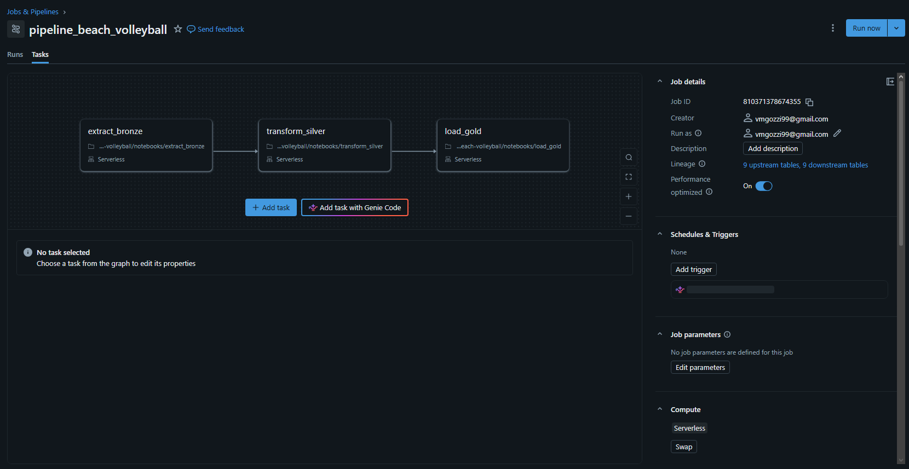
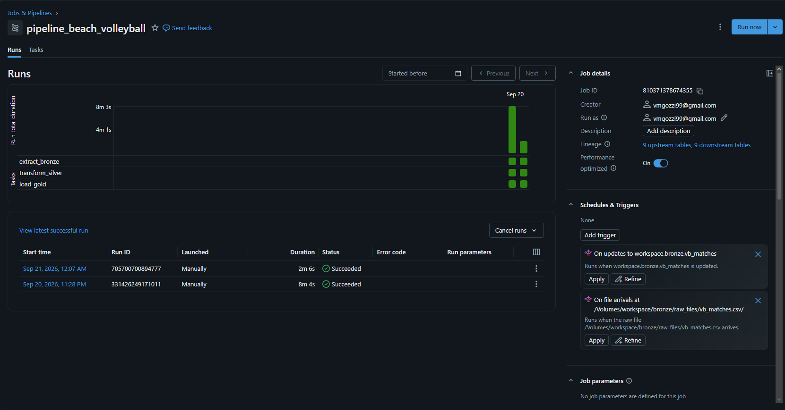

Cada notebook de carga termina com uma validação (chaves únicas, integridade entre tabelas e
contagem de linhas contra a origem), e uma tarefa do Job só passa se ela passar.

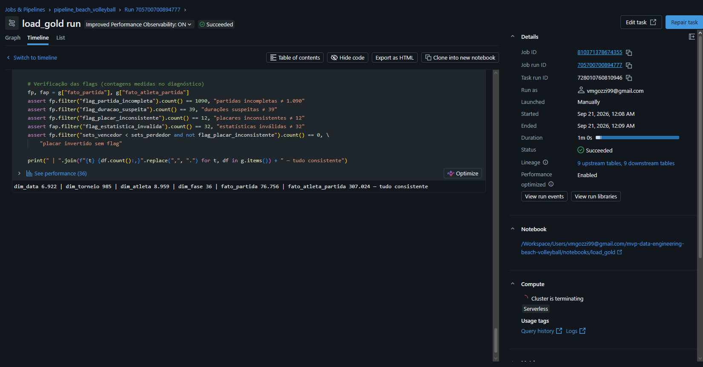


## Qualidade de Dados

O notebook [`diagnostico_qualidade`](notebooks/diagnostico_qualidade.ipynb) percorre a bronze em
cinco frentes: unicidade (chave natural e duplicatas), valores ausentes, formato e domínio das
colunas, variantes de grafia nas categóricas e plausibilidade dos valores (nascimento, altura, idade,
duração, placar). Cada seção termina com um resultado e a decisão de tratamento, aplicada depois no
`transform_silver`. A tabela abaixo é o inventário final do notebook.

| Seção | Problema | Extensão | Tratamento |
|---|---|---|---|
| 2.1 | Fonte sem coluna de id | todas as linhas | `id_partida` = hash de `tournament, date, gender, bracket, match_num` |
| 3 | Ausência codificada como texto `"NA"`, sem NULL real | todas as colunas | converter `"NA"` em NULL antes de qualquer cast |
| 3 | Estatísticas de jogo ausentes | ~81% das partidas, uniforme nas 4 posições (torneio não registrou) | manter NULL; flag `tem_estatistica`; análise restrita a esse subconjunto |
| 3 | Altura ausente | 9,1% perdedores, 5,2% vencedores | manter NULL; excluir da comparação de altura |
| 4.1 | Placar `Forfeit or other` ou `retired` | 1.067 partidas (1,39%) | flag `partida_incompleta`; sets só quando placar completo |
| 4.1 | Ranking nos formatos `Q9` e `24, Q30` | 39,24% dos ranks | separar em `seed_principal` e `seed_qualificatoria` |
| 4.2 | `bracket` com 36 valores | 100% | derivar `fase` (qualificatória, grupos, eliminatória) |
| 5.1 | Altura em polegadas | 100% | converter para cm |
| 5.2 | Idade informada errada (um ano acima) | 460 linhas, três torneios de 2015 | descartar `*_age`; recalcular de `nascimento` e `data` |
| 5.3 | Duração implausível (< 15 min) com placar completo | 39 partidas | flag `duracao_suspeita`, sem excluir |
| 5.4 | Placar contradiz o vencedor | 12 partidas, todas AVP | flag `placar_inconsistente`, sem excluir |
| 5.5 | Dupla vencedora igual à perdedora | 7 partidas (6 bye/W.O. sem placar, 1 erro de registro) | entram em `partida_incompleta`; `vencedor` passa a compor a chave das participações |

O que não deu problema também foi verificado: não há duplicata exata, as categóricas (`circuit`,
`gender`, `bracket`) têm domínio fechado sem variante de grafia, e data, nascimento, duração, altura
e estatísticas seguem um único formato, o que permitiu `cast` estrito no tratamento em vez de
`try_cast`.

Algumas saídas do notebook, com a seção de onde vêm:

**Seção 2.1, chaves candidatas.** Das 255 combinações de colunas testadas, 36 identificam a partida e
duas são mínimas; a adotada é `tournament + date + gender + bracket + match_num`.

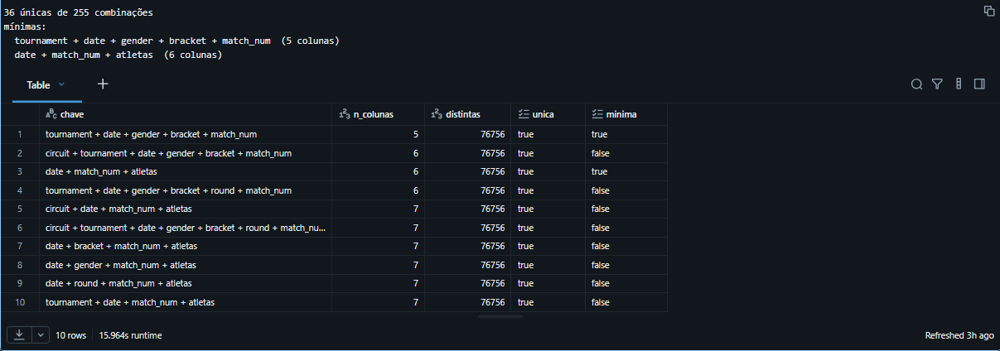

**Seção 2.1, o par de Tenerife 2001.** As mesmas quatro atletas na mesma rodada, com placar e duração
diferentes; é o que obriga `match_num` a entrar na chave.

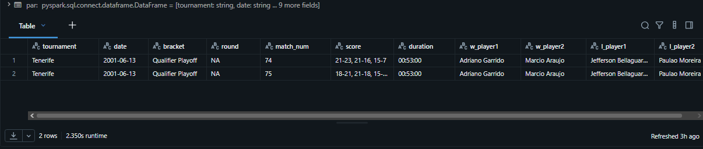

**Seção 3, valores ausentes.** Nenhuma coluna tem NULL real; toda ausência é o texto `"NA"`, e as
estatísticas de jogo faltam em 81% das linhas.

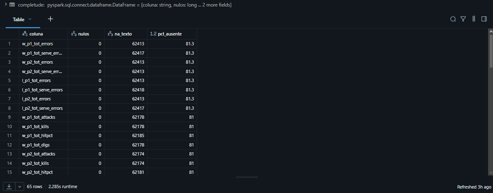

**Seção 4.1, formato dos campos.** Uma coluna representante de cada tipo contra o padrão esperado; só
`score` (1,39%) e `w_rank` (39,24%) fogem, e os dois de propósito.

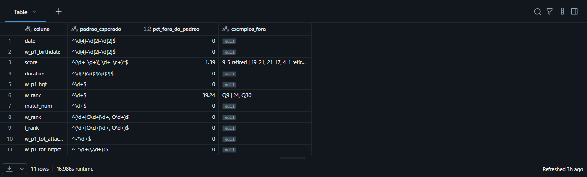

**Seção 5.4, placar e vencedor.** 75.667 placares completos, 1.067 partidas incompletas e as 12 em
que o placar contradiz o vencedor registrado.

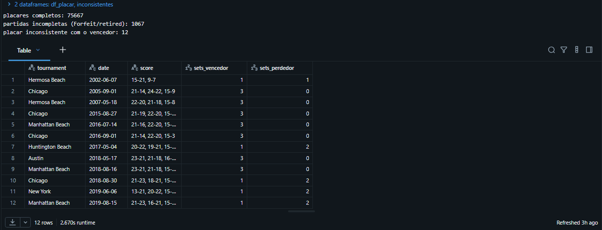

**Seção 5.5, dupla repetida nos dois lados.** As 7 partidas em que a dupla vencedora é igual à
perdedora; seis sem placar (bye ou W.O.) e uma com jogo real (Aydin 2018).

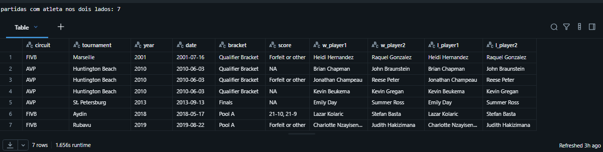

## Análise de Dados

As seis perguntas são respondidas no notebook [`analise_perguntas`](notebooks/analise_perguntas.ipynb),
em SQL, só sobre a camada gold. Cada bloco traz a pergunta, a consulta e o resultado.

### 1. O ranking de entrada prediz o resultado da partida? Com que frequência a dupla pior ranqueada vence, e isso muda entre grupos, qualificatória e eliminatória?

```sql
SELECT coalesce(f.fase, 'total')                            AS fase,
       count(*)                                             AS partidas,
       round(count(p.flag_zebra) / count(*) * 100, 1)       AS pct_com_seed,
       round(avg(cast(p.flag_zebra AS int)) * 100, 1)       AS pct_zebra,
       round(100 - avg(cast(p.flag_zebra AS int)) * 100, 1) AS pct_favorito
FROM workspace.gold.fato_partida p
JOIN workspace.gold.dim_fase f USING (id_fase)
WHERE NOT p.flag_partida_incompleta
GROUP BY ROLLUP(f.fase)
ORDER BY CASE fase WHEN 'qualificatoria' THEN 1 WHEN 'grupos' THEN 2 WHEN 'eliminatoria' THEN 3 ELSE 4 END
```

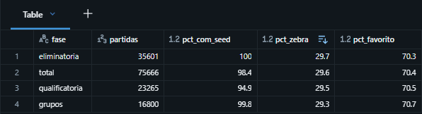

**Resultado.** O ranking prediz o resultado. O favorito vence 70,4% das partidas, contra os 50% que se esperaria se o seed não contribuísse com nada, e a fase não muda isso, com 70,5% na qualificatória, 70,7% nos grupos e 70,3% na eliminatória. A variação de 0,4 ponto percentual entre as fases está dentro do ruído, então a ideia de que a eliminatória seria mais imprevisível não se sustenta.

### 2. O jogo mudou ao longo das duas décadas? Duração das partidas e proporção de 2×1 por circuito e por período.

```sql
SELECT t.circuito,
       d.ciclo_olimpico,
       min(d.ano)                                            AS de,
       max(d.ano)                                            AS ate,
       count(*)                                              AS partidas,
       round(avg(p.duracao_min), 1)                          AS duracao_media_min,
       round(avg(cast(p.total_sets = 3 AS int)) * 100, 1)    AS pct_tres_sets,
       round(avg(p.total_pontos), 1)                         AS pontos_por_partida,
       round(avg(p.duracao_min) / avg(p.total_pontos) * 60, 1) AS segundos_por_ponto
FROM workspace.gold.fato_partida p
JOIN workspace.gold.dim_torneio t USING (id_torneio)
JOIN workspace.gold.dim_data d USING (id_data)
WHERE NOT p.flag_partida_incompleta
  AND NOT p.flag_duracao_suspeita
  AND p.duracao_min IS NOT NULL
GROUP BY t.circuito, d.ciclo_olimpico
ORDER BY t.circuito, min(d.ano)
```

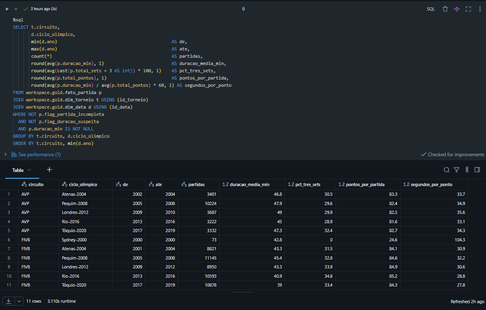

**Resultado.** O jogo mudou, mas só em um dos circuitos.

- **FIVB:** a partida média encurtou de 45,4 minutos no ciclo de Pequim para 39,0 no de Tóquio, com 84 a 85 pontos por partida em todos os ciclos. O que caiu foi o tempo por ponto, de 32,2 para 27,8 segundos, enquanto a proporção de 2×1 subiu de 31,5% para cerca de 34%.  As causas possíveis são ritmo de jogo, regras de intervalo ou critério de medição da duração, e o dado não distingue entre elas.
- **AVP:** nada se alterou. Duração entre 45 e 49 minutos e 2×1 entre 29% e 32% em todos os ciclos. O circuito não aparece em 2011 e 2012 porque faliu em agosto de 2010 e só voltou em 2012.
- **Comparação entre circuitos:** a diferença de duração era de 3 minutos no início da série e chega a 8 no fim.
- **Observação:** Sydney 2000 tem 0% de três sets e 104 segundos por ponto porque a partida era de set único até 15 com *side-out*, em que só quem sacava pontuava. O formato atual, de melhor de três sets a 21, entrou em 2001.

### 3. Quem é mais alto vence mais? A relação é a mesma no masculino e no feminino?

```sql
SELECT
  a.genero,
  FLOOR(a.altura_cm / 5) * 5                                     AS faixa_altura,
  COUNT(*)                                                       AS participacoes,
  ROUND(100 * AVG(CASE WHEN f.vencedor THEN 1 ELSE 0 END), 1)    AS taxa_vitoria
FROM workspace.gold.fato_atleta_partida f
JOIN workspace.gold.dim_atleta a USING (id_atleta)
WHERE a.altura_cm IS NOT NULL
GROUP BY 1, 2
HAVING COUNT(*) >= 1000
ORDER BY 1, 2
```

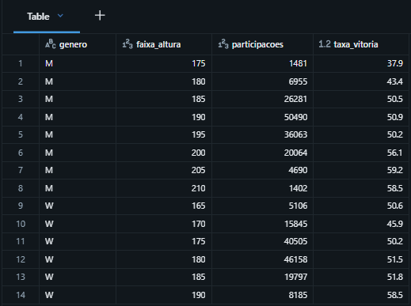

**Resultado.**  Sim, mas principalmente nas pontas. No masculino, a taxa de vitória aumenta com a altura: 37,9% na faixa de 175 cm, 43,4% na de 180 cm, e depois se estabiliza em um patamar de 50 a 51% entre 185 e 199 cm, intervalo que concentra três de cada quatro participações. Acima de 200 cm, a taxa volta a subir para 56,1% e chega a 59,2% na faixa de 205 cm. Entre a faixa mais baixa e a mais alta, a diferença chega a 21 pontos percentuais, a maior distância entre grupos de atletas encontrada neste trabalho.

No feminino, o padrão é semelhante, com um patamar intermediário mais amplo: entre 175 e 189 cm, faixa que concentra 80% das participações, a taxa de vitória permanece entre 50,2% e 51,8%. A faixa de 170 cm apresenta 45,9%, enquanto atletas com 190 cm ou mais chegam a 58,5%. A exceção é a faixa de 165 cm, com 50,6%; como reúne poucas participações (5 mil), é possível que essas atletas compensem a menor estatura com outros atributos para competir no circuito. A relação, portanto, aparece nos dois gêneros com direção e formato semelhantes; no masculino, a transição é mais longa porque a distribuição de alturas é mais espalhada.

Na prática, a altura parece oferecer vantagem principalmente nos extremos da distribuição: atletas muito altos apresentam taxas de vitória superiores, enquanto atletas muito baixos entram em desvantagem. Já dentro da faixa mais comum do circuito, a estatura pouco diferencia vencedores de perdedores.

### 4. A idade pesa no resultado? Em que faixa etária a taxa de vitória é maior?

```sql
SELECT
  LEAST(GREATEST(FLOOR(idade_na_partida / 5) * 5, 15), 40)      AS faixa_etaria,
  COUNT(*)                                                      AS participacoes,
  ROUND(100 * AVG(CASE WHEN vencedor THEN 1 ELSE 0 END), 1)     AS taxa_vitoria
FROM workspace.gold.fato_atleta_partida
WHERE idade_na_partida IS NOT NULL
  AND NOT flag_idade_atipica
GROUP BY 1
ORDER BY 1
```

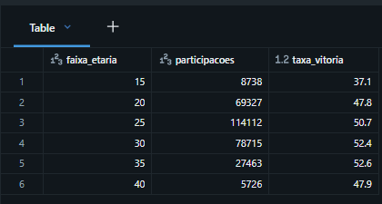

**Resultado.** Pesa, mas pouco depois dos 25. A taxa de vitória sobe com a idade até os 30 e só cai depois
dos 40. A faixa mais numerosa é a de 25 a 29 anos (114 mil participações, 37% do total), mas quem vence mais
é a de 30 a 39: 35% das participações e a maior taxa de vitória. A vantagem, porém, é pequena: 2 pontos
percentuais sobre a faixa de 25 a 29, e as duas ficam a menos de 3 pontos dos 50% que seria o esperado caso
a idade não impactasse na vitória. Medida sobre mais de 100 mil participações, essa diferença não é ruído,
mas é pequena perto da distância entre os mais jovens e os demais: o menor de 20 anos vence 37% das vezes,
15 pontos abaixo da faixa de 35 a 39. Dessa forma, a idade não separa vencedores entre os adultos; separa
quem talvez ainda não tenha maturidade para o circuito

### 5. Jogar em casa ajuda? Taxa de vitória quando o torneio é no país do atleta, comparada a fora.

```sql
SELECT
  circuito,
  flag_em_casa                                                   AS em_casa,
  COUNT(*)                                                       AS participacoes,
  ROUND(100 * COUNT(*) / SUM(COUNT(*)) OVER (PARTITION BY circuito), 1) AS pct_participacoes,
  ROUND(100 * AVG(CASE WHEN vencedor THEN 1 ELSE 0 END), 1)      AS taxa_vitoria
FROM workspace.gold.fato_atleta_partida
JOIN workspace.gold.dim_torneio USING (id_torneio)
GROUP BY 1, 2
ORDER BY 1, 2 DESC
```

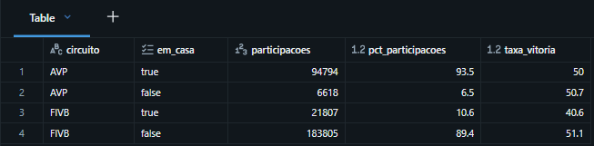

**Resultado.** Não. No AVP a pergunta quase não se aplica: 93,5% das participações são de atletas dos
Estados Unidos jogando nos Estados Unidos, e os dois lados vencem 50% (50,0 em casa, 50,7 fora). É no
FIVB, onde jogar em casa é a exceção (10,6% das participações), que a comparação vale, e o resultado é o
contrário do esperado: o atleta em casa vence 40,6% das partidas, contra 51,1% de quem joga fora. São 10,5
pontos percentuais contra o mandante.

Uma leitura possível é que o efeito venha da porta de entrada, não de nervosismo diante da torcida: o regulamento da FIVB
reserva vagas de convite para atletas do país-sede, que entram sem passar pelo ranking.

### 6. Nas partidas com estatística detalhada, qual fundamento mais separa vencedores de perdedores: ataque, saque, bloqueio ou defesa?

```sql
SELECT
  a.genero,
  f.vencedor,
  COUNT(*)                          AS participacoes,
  ROUND(AVG(f.tot_attacks), 1)      AS ataques,
  ROUND(AVG(f.tot_kills), 1)        AS pontos_ataque,
  ROUND(AVG(f.tot_hitpct), 2)       AS aproveitamento,
  ROUND(AVG(f.tot_errors), 1)       AS erros_ataque,
  ROUND(AVG(f.tot_aces), 2)         AS aces,
  ROUND(AVG(f.tot_serve_errors), 2) AS erros_saque,
  ROUND(AVG(f.tot_blocks), 2)       AS bloqueios,
  ROUND(AVG(f.tot_digs), 1)         AS defesas
FROM workspace.gold.fato_atleta_partida f
JOIN workspace.gold.dim_atleta a USING (id_atleta)
WHERE f.tem_estatistica
  AND NOT f.flag_estatistica_invalida
GROUP BY 1, 2
ORDER BY 1, 2 DESC
```

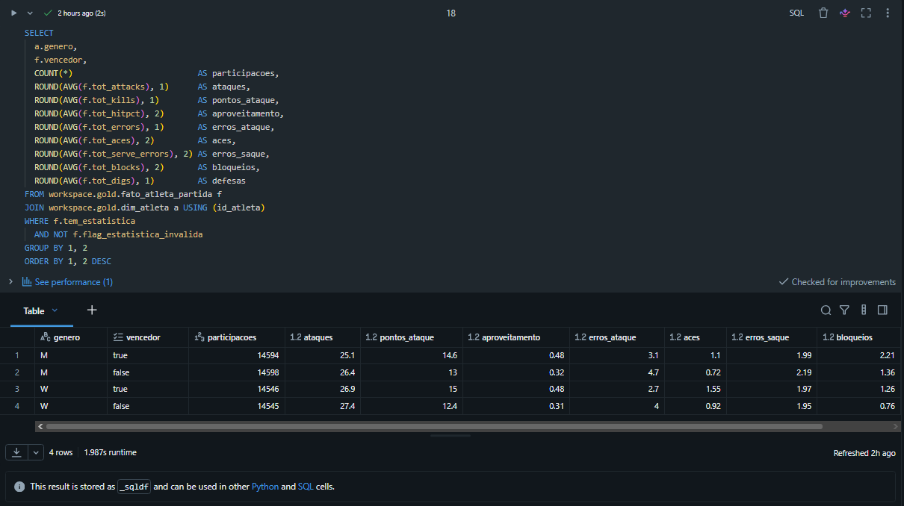

**Resultado.** O ataque, nos dois gêneros. Vencedores e perdedores atacam quase o mesmo tanto (25,1 contra 26,4 tentativas no masculino, 26,9 contra 27,4 no feminino), mas o vencedor converte mais (14,6 contra 13,0 pontos no masculino; 15,0 contra 12,4 no feminino) e erra menos (3,1 contra 4,7; 2,7 contra 4,0): o aproveitamento vai de 0,32 para 0,48 entre os homens e de 0,31 para 0,48 entre as mulheres. Somando pontos ganhos e erros evitados, são 3,2 pontos de diferença por atleta no masculino e 3,9 no feminino, mais que todos os outros fundamentos juntos. Bloqueio e ace têm a maior diferença proporcional (bloqueios 2,21 contra 1,36 e 1,26 contra 0,76; aces 1,10 contra 0,72 e 1,55 contra 0,92), mas acontecem pouco e somam pouco mais de um ponto por atleta nos dois gêneros; defesa fica no meio (7,3 contra 6,3; 9,6 contra 8,0) e erro de saque quase não separa (1,99 contra 2,19; 1,97 contra 1,95). O que muda entre gêneros é o volume de cada fundamento, não o que separa vencedor de perdedor: homens bloqueiam quase o dobro, mulheres fazem mais aces e defesas. Na prática, o que mais separa quem vence não é atacar mais nem sacar melhor, e sim errar menos no ataque.

### Discussão geral
A pergunta central era o que separa quem vence no vôlei de praia profissional e se isso mudou ao longo de duas décadas. As seis análises apontam para a mesma direção: dentro do circuito, a execução é o principal diferencial entre vencedores e perdedores, enquanto o biotipo exerce um efeito mais específico e concentrado nas extremidades da distribuição. O contexto, por sua vez, tem pouca influência sobre os resultados.

O biotipo pesa nas extremidades da distribuição. Homens abaixo de 1,80 m e mulheres abaixo de 1,75 m apresentam desvantagem, assim como os menores de 20 anos, que vencem apenas 37% das partidas, enquanto jogadores acima de 2,00 m e jogadoras acima de 1,90 m alcançam taxas de vitória próximas de 60%. Entre esses extremos, que concentram a grande maioria das participações, a taxa permanece próxima de 50%. Altura e idade, portanto, parecem funcionar mais como pré-requisito para estar no circuito do que como vantagem dentro dele; entre a maioria dos atletas, pouco diferenciam vencedores de perdedores.

A execução, por outro lado, aparece de forma consistente em diferentes recortes. O favorito pelo ranking vence cerca de sete em cada dez partidas, independentemente da fase, indicando uma hierarquia real e relativamente estável. Em quadra, o principal diferencial está no ataque: vencedores e perdedores atacam em volumes semelhantes, mas os vencedores cometem menos erros e convertem uma parcela maior das oportunidades. Bloqueios e aces também diferenciam os resultados, mas representam uma parcela menor da produção de pontos.

O contexto, por sua vez, tem pouco efeito aparente. Jogar em casa não produz uma vantagem relevante e, no circuito FIVB, a vaga destinada ao país-sede costuma ser ocupada por equipes que ainda não apresentam nível consolidado de circuito.

Por fim, o jogo mudou, mas só na FIVB: a partida ficou cerca de seis minutos mais curta com o mesmo
número de pontos, ou seja, mais rápida. No AVP, duração e proporção de 2×1 ficaram estáveis nas duas
décadas.

## Autoavaliação

**Objetivos.** As seis perguntas foram respondidas, cada uma com uma consulta sobre a camada gold, e
a pergunta central tem resposta na discussão. O pipeline ficou completo: três camadas com validação
em cada carga, catálogo aplicado no Unity Catalog e um Job encadeando a carga de ponta a ponta.

**Dificuldades.**

- A fonte não tem identificador nem de partida nem de atleta. Encontrar a chave natural mínima da
  partida exigiu testar 255 combinações de colunas, e a chave das participações quebrou quando a
  validação acusou 7 partidas com a mesma dupla registrada como vencedora e perdedora.
- Lidar com as partidas encerradas pela metade. O placar traz `Forfeit or other`, placar parcial
  seguido de `retired` ou nada, e o dado não diz a causa: W.O., lesão, desistência ou erro de
  registro ficam indistinguíveis. O vencedor existe, mas sets, pontos e duração não podem entrar nas
  contas. A saída foi decompor o placar só quando ele é regular e marcar o resto com uma flag, sem
  excluir a partida. É uma solução que contorna o problema em vez de resolvê-lo: a partida fica
  fora das contas que dependem de placar, mas continua sem explicação.
- O Databricks Free Edition ficou instável em certos horários. Houve horas em que não consegui rodar o pipeline e tive que retornar no dia seguinte desacelerando o trabalho.
- Achar uma consulta simples para cada pergunta. Houve bastante tentativa e erro da minha parte. Na pergunta da
  altura, por exemplo, comecei comparando a altura média de quem ganha e de quem perde, e a
  diferença deu menos de um centímetro. Tecnicamente respondia a pergunta, mas não dizia nada.
  Quando troquei para taxa de vitória por faixa de altura, a consulta ficou menor e apareceu o que
  interessava: a altura pesa nas pontas, não no meio.

**Trabalhos futuros.**

- Levar o mesmo pipeline para o vôlei de quadra, tenho interesse de explorar uma analise similar aplicado VNL (Liga das Nações). Acredito que esse trabalho serviria como esqueleto para isso.
- Trocar o upload manual por coleta automática, via API ou scraping do site da FIVB, com o Job
  agendado para rodar quando houver torneio novo. Isso exigiria carga incremental na silver e na gold
  em vez do `overwrite` de hoje.
